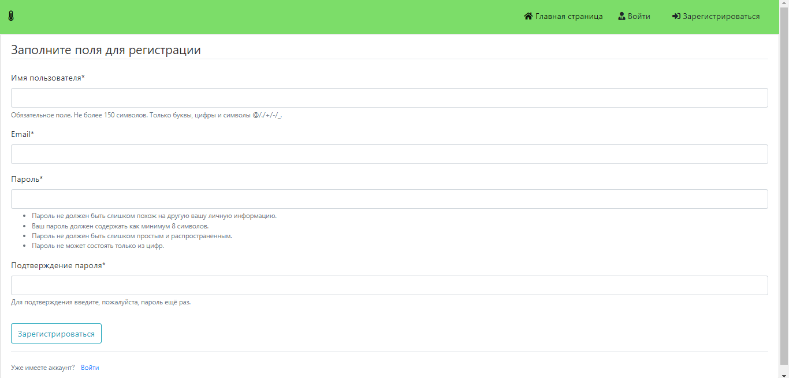
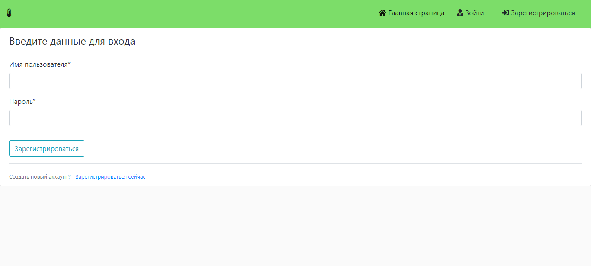
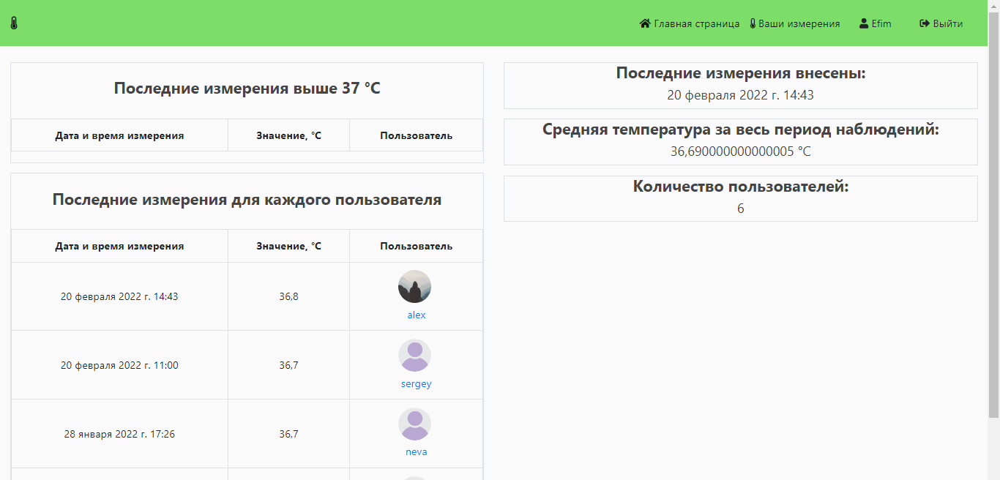
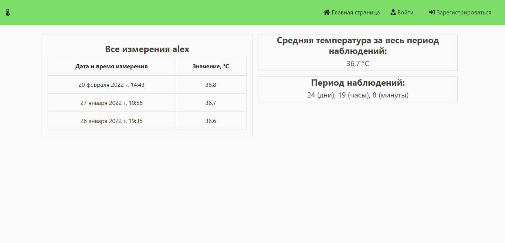
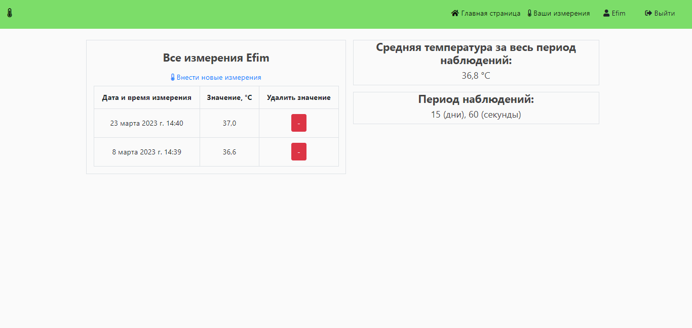
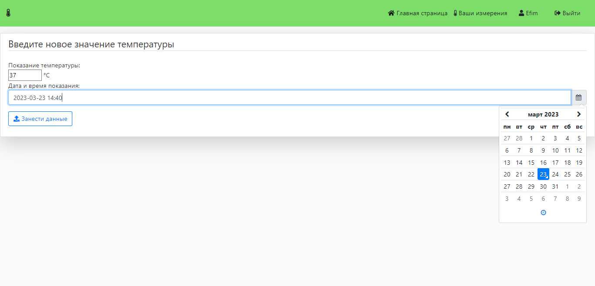

# Web application for monitoring the measured body temperature

## Application features:

- ### SignUp 
 
- ### LogIn 
 
- ### Measurement statistics of all users 
 
- ### Measurement statistics of user 
 
- ### Statistics of the registered user 
 
- ### Adding a measurement 
 

## Stack:
 - Python
 - Django
 - SQLite

